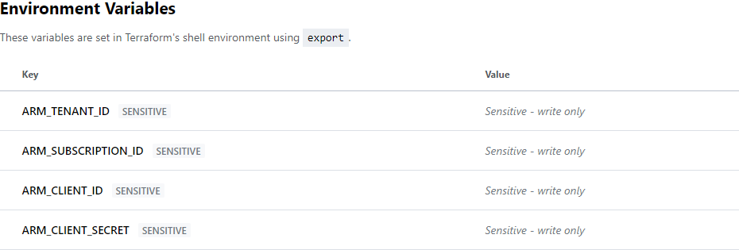
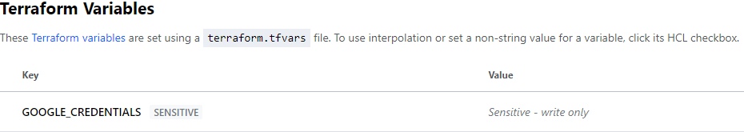

# Terraform Cloud Variables

- [AWS](https://registry.terraform.io/providers/hashicorp/aws/latest/docs)

  

  - [~/.aws/credentials](https://docs.aws.amazon.com/en_us/cli/latest/userguide/cli-configure-files.html#cli-configure-files-where)

    - `AWS_ACCESS_KEY_ID`
    - `AWS_SECRET_ACCESS_KEY`

- [Azure](https://registry.terraform.io/providers/hashicorp/azurerm/latest/docs/guides/service_principal_client_secret#configuring-the-service-principal-in-terraform)

  

  ```
  az ad sp create-for-rbac --name <service_principal_name> --role Contributor
  ```

  - 👉 [az ad sp create-for-rbac](https://docs.microsoft.com/en-us/cli/azure/ad/sp?view=azure-cli-latest#az_ad_sp_create_for_rbac)

    - `ARM_SUBSCRIPTION_ID`
    - `ARM_TENANT_ID`
    - `ARM_CLIENT_ID`
    - `ARM_CLIENT_SECRET`

  - [Azure Provider: Authenticating using a Service Principal with a Client Secret](https://registry.terraform.io/providers/hashicorp/azurerm/latest/docs/guides/service_principal_client_secret#configuring-the-service-principal-in-terraform)

    ```
    provider "azurerm" {
      features {}
    }
    ```

- [Google Cloud](https://registry.terraform.io/providers/hashicorp/google/latest/docs/guides/provider_reference#full-reference)

  

  - 👉 [gcloud iam service-accounts keys create](https://cloud.google.com/sdk/gcloud/reference/iam/service-accounts/keys/create)

    - `GOOGLE_CREDENTIALS` -> The content of created key file.

  - 👉 [Google Provider Configuration Reference](https://registry.terraform.io/providers/hashicorp/google/latest/docs/guides/provider_reference#full-reference)

    ```conf
    provider "google" {
      credentials = var.GOOGLE_CREDENTIALS
      # credentials = coalesce(var.GOOGLE_CREDENTIALS, try(file(var.GOOGLE_CLOUD_KEYFILE_JSON), ""))
    }
    ```

- [OCI (Oracle Cloud Infrastructure)](https://registry.terraform.io/providers/hashicorp/oci/latest/docs)

  

  - tenancy_ocid
  - user_ocid
  - fingerprint
  - private_key
